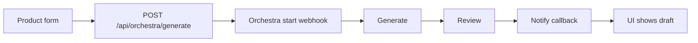

# Product Content Studio

Next.js app that starts an Orchestra pipeline to draft ecommerce product
descriptions, then lets you copy, download, or generate another version.

## How it works



1. The form posts product name, category, features, and tone.
2. The server starts the Orchestra pipeline and returns a `runId`.
3. The browser makes **one** wait request (`/api/orchestra/runs/{runId}/wait`).
4. Orchestra runs **Generate → Review → Notify Product Content Studio**.
5. Notify `POST`s draft + review to `/api/orchestra/callback` (shared secret).
6. The UI shows the draft with Copy and Download `.txt`. Submit the form again
   for a new version.

## Stack

- Next.js 16 (App Router), React 19, TypeScript
- Tailwind CSS v4, shadcn/ui
- React Hook Form + Zod
- Vitest
- Orchestra (webhook start, HTTP callback, Metadata API for status)

No database and no login. Run data lives in memory on the server process.

## Local setup

```bash
npm install
cp .env.example .env.local
npm run dev
```

Open [http://localhost:3000](http://localhost:3000).

### Environment variables

| Variable | Required | Purpose |
|----------|----------|---------|
| `ORCHESTRA_WEBHOOK_URL` | yes | Pipeline start URL from Orchestra |
| `ORCHESTRA_API_TOKEN` | yes | Bearer token for Orchestra Metadata API |
| `ORCHESTRA_CALLBACK_SECRET` | yes | Shared secret for the Notify HTTP header |
| `ORCHESTRA_REQUEST_TIMEOUT_MS` | no | Outbound Orchestra timeout (default `15000`) |
| `ORCHESTRA_API_BASE_URL` | no | Defaults to `https://app.getorchestra.io/api/engine/public` |
| `ORCHESTRA_UI_BASE_URL` | no | Defaults to `https://app.getorchestra.io` |

## Orchestra setup

Expected pipeline shape:

`Generate → Review → Notify Product Content Studio`

Notify HTTP task:

- **Connection Base URL** — public app URL (Vercel production URL)
- **Path** — `/api/orchestra/callback`
- **Method** — `POST`
- **Header**

```json
{
  "X-Orchestra-Callback-Secret": "<same value as ORCHESTRA_CALLBACK_SECRET>"
}
```

- **Body** (conceptually)

```json
{
  "runId": "<pipeline run id>",
  "description": "<generated description>",
  "review": {
    "status": "APPROVE | REVIEW",
    "reason": "<short reason>"
  }
}
```

Local `npm run dev` is not reachable from Orchestra. Use a **Vercel deploy** (or a
tunnel) so Notify can hit the callback.

## Deploy on Vercel

```bash
npx vercel login
npx vercel
npx vercel --prod
```

Add the env vars above for **Production** and **Preview**, then redeploy.

In Orchestra, set the HTTP connection Base URL to your Vercel URL, for example:

`https://your-project.vercel.app`

Path stays `/api/orchestra/callback`.

### Limits to know

- `/wait` uses `maxDuration = 120`. Hobby plans may cap lower (~60s). If wait
  times out, the callback can still land — use **Check status**.
- In-memory store: generate and callback must hit the **same** deployment /
  instance. Prefer one production deployment for demos.

## API routes

| Method | Path | Role |
|--------|------|------|
| `POST` | `/api/orchestra/generate` | Validate form, start pipeline, remember run |
| `POST` | `/api/orchestra/callback` | Receive draft + review from Orchestra Notify |
| `GET` | `/api/orchestra/runs/[runId]/wait` | Wait until draft is ready (or timeout ~110s) |
| `GET` | `/api/orchestra/runs/[runId]` | Current run view (draft + status) |

Secrets never go to the browser. The UI only talks to these routes.

## Commands

```bash
npm run dev    # local app
npm test       # vitest
npm run lint   # eslint
npm run build  # production build
npm start      # serve the build
```
