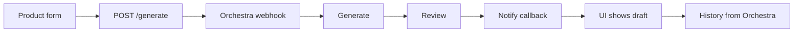

# Product Content Studio

Next.js app that uses an Orchestra pipeline to generate ecommerce product
descriptions. You can copy or download the draft, submit again for a new
version, and reopen recent runs from history.

**Live demo:** [ai-product-content-studio-henna.vercel.app](https://ai-product-content-studio-henna.vercel.app/)

## What you can do in the UI

- Fill product name, category, features, and tone
- Wait for Orchestra to generate and review the description
- Copy or download the draft as `.txt`
- Submit the form again for another version (optional previous vs new compare)
- Open **History** to pick a past run; the full draft opens in the right panel

## How it works



1. The form posts product details to the app.
2. The server starts the Orchestra pipeline and returns a `runId`.
3. The browser waits once on `/api/orchestra/runs/{runId}/wait`.
4. Orchestra runs **Generate → Review → Notify Product Content Studio**.
5. Notify `POST`s the draft to `/api/orchestra/callback` (shared secret).
6. The UI shows the description. History stores recent `runId`s (HttpOnly cookie)
   and loads each run from Orchestra status + task runs.

## Stack

- Next.js 16 (App Router), React 19, TypeScript
- Tailwind CSS v4, shadcn/ui
- React Hook Form + Zod
- Vitest
- Orchestra (start webhook, HTTP callback, per-run Metadata API)

No database and no login.

## Local setup

```bash
npm install
cp .env.example .env.local
npm run dev
```

Open [http://localhost:3000](http://localhost:3000).

### Environment variables

| Variable | Required | Purpose |
|----------|----------|---------|
| `ORCHESTRA_WEBHOOK_URL` | yes | Pipeline start URL from Orchestra |
| `ORCHESTRA_API_TOKEN` | yes | Bearer token for Orchestra run status / history |
| `ORCHESTRA_CALLBACK_SECRET` | yes | Shared secret for the Notify HTTP header |
| `ORCHESTRA_REQUEST_TIMEOUT_MS` | no | Outbound timeout (default `15000`) |
| `ORCHESTRA_API_BASE_URL` | no | Default: `https://app.getorchestra.io/api/engine/public` |
| `ORCHESTRA_UI_BASE_URL` | no | Default: `https://app.getorchestra.io` |

## Orchestra pipeline

Expected shape (no human approval step required for this app):

`Generate → Review → Notify Product Content Studio`

### Notify HTTP task

| Field | Value |
|-------|--------|
| Connection Base URL | Your public app URL (e.g. Vercel) |
| Path | `/api/orchestra/callback` |
| Method | `POST` |
| Auth | None (secret is in the header below) |

**Custom headers**

```json
{
  "X-Orchestra-Callback-Secret": "<same value as ORCHESTRA_CALLBACK_SECRET>"
}
```

**JSON body**

```json
{
  "runId": "${{ ORCHESTRA.PIPELINE_RUN_ID }}",
  "description": "${{ ORCHESTRA.PIPELINE_RUN_TASKS['<generate-task-id>'].OUTPUTS['results']['description'] }}",
  "review": {
    "status": "${{ ORCHESTRA.PIPELINE_RUN_TASKS['<review-task-id>'].OUTPUTS['results']['status'] }}",
    "reason": "${{ ORCHESTRA.PIPELINE_RUN_TASKS['<review-task-id>'].OUTPUTS['results']['reason'] }}"
  }
}
```

Local `npm run dev` is not public. Deploy to Vercel (or use a tunnel) so Notify
can reach the callback.

## Deploy on Vercel

```bash
npx vercel login
npx vercel --prod
```

Add the env vars for **Production** and **Preview**, then redeploy.

Point the Orchestra HTTP connection Base URL at your deployment, for example:

`https://ai-product-content-studio-henna.vercel.app`

### Limits

- `/wait` uses `maxDuration = 120`. On Hobby the cap may be lower (~60s). If the
  UI stays on “Generating”, use **Check status**.
- In-memory run cache is per serverless instance. Prefer one production URL for demos.
- History uses an HttpOnly cookie of recent `runId`s and hydrates drafts from
  Orchestra. Workspace-wide `list_pipeline_runs` is not required (it may be
  disabled on some accounts).

## API routes

| Method | Path | Role |
|--------|------|------|
| `POST` | `/api/orchestra/generate` | Start pipeline, set history cookie |
| `POST` | `/api/orchestra/callback` | Receive draft + review from Notify |
| `GET` | `/api/orchestra/runs/[runId]/wait` | Wait until draft is ready |
| `GET` | `/api/orchestra/runs/[runId]` | Current run view |
| `GET` | `/api/orchestra/history` | Recent runs hydrated from Orchestra |

Secrets stay on the server. The browser only calls these routes.

## Commands

```bash
npm run dev
npm test
npm run lint
npm run build
npm start
```
